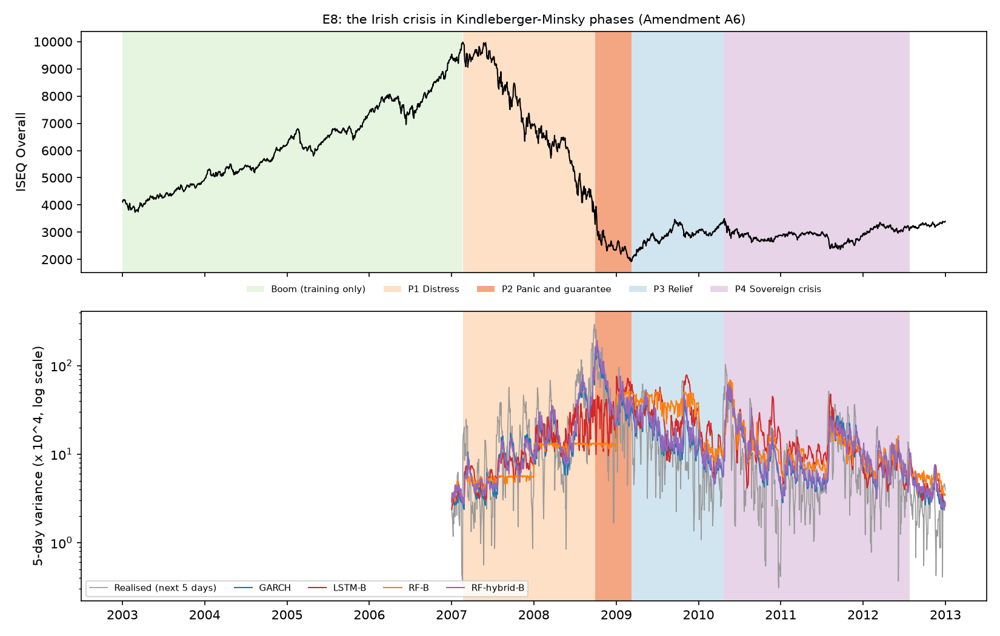
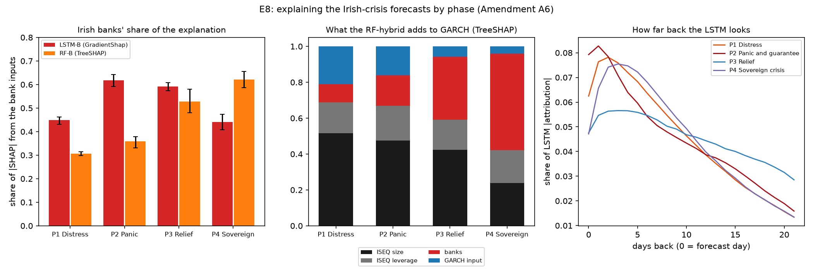

# Irish focus — one market, one crisis (Amendment A6, E8)

> Study notes and results, prepared with AI assistance (see `notes/ai_use.md`). **Not dissertation text.** Every
> result here is **exploratory**: the change of focus was made on 2 Oct 2026, after the main results were known, and
> was written into `PREREGISTRATION.md` (Amendment A6, commit `cedda32`) **before** any of these models ran. The
> pre-registered tests (H1–H4) and E1–E7 remain in the repository and should be reported in an appendix.

## 1. The question
Read the **Irish financial crisis of 2007–2012** as one Minsky–Kindleberger episode, using **Irish data only**.
Questions:
- Which models forecast ISEQ volatility best in each phase of the crisis?
- Does a model trained only on the calm boom fail when the crisis comes (the Minsky test)?
- What do the models rely on, phase by phase? The checks are whether Irish bank stress matters, how much price
  falls matter, and how far back the models look.

## 2. Data — Irish only
*In-depth version — sources, background, quality checks, statistics by phase, stylised facts: [docs/Irish_Dataset_Handbook.md](docs/Irish_Dataset_Handbook.md) (also PDF and Word).*

| Series | Source | Use |
|---|---|---|
| ISEQ Overall, daily close, Oct 2002 – 2012 | Yahoo Finance `^ISEQ` (existing dataset) | target and ISEQ features |
| Bank of Ireland, daily adjusted close | Yahoo Finance `BIRG.IR` (from 2002) | bank features |
| AIB, daily adjusted close | Yahoo Finance `A5G.IR` (from 2002) | bank features |

The bank return is the average of the two banks' daily log returns. The bank data are cached in `data/raw/`; like
all Yahoo data they are not committed.

**What was checked and not used (2 Oct 2026):**
- **GitHub:** no better ISEQ dataset. Repositories with ISEQ data take it from Yahoo, as this project does.
- **PTSB (`PTSB.IR`):** too stale; 51% of its 2010–12 days show no price change.
- **Daily Irish government bond yields:** not freely available. Eurostat's daily series (`irt_lt_mcby_d`) is no
  longer published, and no daily ECB series was found; only monthly yields are free.
- **Irish Economic Policy Uncertainty index:** monthly only.
- **Intraday ISEQ data** (for true realised volatility): not free.

## 3. The phases
The dates come from the Irish timeline in the Literature Handbook (section B), written before any results.

| Phase | Dates | ISEQ | Volatility (annual) | Days scored |
|---|---|---|---|---|
| Boom — Minsky's calm (training only) | 2 Jan 2003 – 19 Feb 2007 | +149% | 13% | — |
| **P1 Distress** | 20 Feb 2007 (ISEQ peak) – 29 Sep 2008 | −67% | 34% | 408 |
| **P2 Panic and lender of last resort** | 30 Sep 2008 (bank guarantee) – 9 Mar 2009 (trough) | −42% | 53% | 112 |
| **P3 Relief** | 10 Mar 2009 – 22 Apr 2010 | +76% | 27% | 281 |
| **P4 Sovereign crisis** | 23 Apr 2010 (Greek request) – 26 Jul 2012 (Draghi) | −7% | 23% | 574 |
| Whole crisis | 20 Feb 2007 – 26 Jul 2012 | | | 1,375 |



## 4. The features, explained
Every feature uses only information available at the ISEQ close on day *t*. The **target** is the log of the next
5 days' realised variance: the sum of the squared ISEQ returns on days *t+1 … t+5*.

| Feature | Formula | What it measures | Why it should help |
|---|---|---|---|
| `rv_d` | log r²ₜ | today's ISEQ shock | volatility clusters: a big move today predicts big moves soon (ARCH/GARCH idea) |
| `rv_w` | log of the mean of r² over the last 5 days | last week's volatility | short-horizon traders (HAR weekly component, Corsi 2009) |
| `rv_m` | log of the mean of r² over the last 22 days | last month's volatility | slow, persistent part of volatility (HAR monthly component) |
| `lev_d` | min(rₜ, 0) | today's fall (0 on an up day) | **leverage effect**: falls raise volatility more than rises (Corsi & Renò 2012) |
| `lev_w` | mean of min(r, 0) over 5 days | last week's falls | a run of falls — Kindleberger's *distress* |
| `lev_m` | mean of min(r, 0) over 22 days | last month's falls | a slow-burning decline |
| `bank_rv_d` | log of the squared bank return today | stress in Irish banks today | the **Minsky channel**: the Irish crisis began in the banks |
| `bank_rv_w` | log of the mean squared bank return, 5 days | bank stress last week | as above, smoothed |
| `bank_rv_m` | log of the mean squared bank return, 22 days | bank stress last month | persistent banking stress |
| `log_garch` (hybrid only) | log of GARCH's own 5-day forecast | the econometric model's view | the structural anchor the learner corrects |

**Feature sets**
- **Set A (ISEQ only, 6):** `rv_d`, `rv_w`, `rv_m`, `lev_d`, `lev_w`, `lev_m`.
- **Set B (ISEQ + banks, 9):** Set A plus `bank_rv_d`, `bank_rv_w`, `bank_rv_m`.
- **LSTM inputs:** the daily ISEQ return and log squared return over the last 22 days. Set B adds the same pair for
  the banks. The network builds its own weekly and monthly summaries from these.

## 5. The models, in plain words
| Model | Type | How it forecasts |
|---|---|---|
| **GARCH(1,1)-t** | econometric | tomorrow's variance = a base level + a reaction to the last shock + memory of the last variance |
| **HAR** | econometric | regression of next week's variance on daily, weekly and monthly variance |
| **LSTM** | deep learning | reads the last 22 days in order and learns which patterns come before high volatility |
| **Random Forest** | machine learning | the average of 500 decision trees, each built on a random sample of days and features |
| **SVR** | machine learning | fits a smooth function and ignores errors smaller than ε |
| **XGBoost** | machine learning | trees built one after another, each fixing the errors of the previous ones |
| **Random Forest-hybrid** | hybrid | the forest forecasts how far GARCH will be wrong; forecast = GARCH × that correction |

**Rules**
- **Walk-forward:** refitted every year (test years 2007–2012).
- **Training data:** fitting days up to two years before the test year; the last year is used for validation.
- **Tuning:** each learner was tuned once on the first window (2003–05) with `GridSearchCV` and
  `TimeSeriesSplit(5, gap 5)`.
- **LSTM:** 22-day windows, 64 units in 2 layers, 5 seeds averaged.

## 6. Results

### 6.1 Which model forecasts best? (QLIKE, lower is better; ✔ = in the 90% Model Confidence Set)
| Model | P1 Distress | P2 Panic | P3 Relief | P4 Sovereign | Whole crisis |
|---|---|---|---|---|---|
| GARCH | 0.503 ✔ | **0.279** ✔ | 0.327 ✔ | 0.374 ✔ | 0.395 ✔ |
| HAR | 0.752 | 0.412 ✔ | **0.309** ✔ | 0.380 ✔ | 0.478 |
| LSTM-A (ISEQ) | 0.805 | 1.382 | 0.442 | 0.418 ✔ | 0.616 |
| LSTM-B (+banks) | 0.601 ✔ | 1.030 ✔ | 0.452 ✔ | 0.420 ✔ | 0.530 |
| Random Forest-A | 1.185 | 1.845 | 0.418 ✔ | 0.395 ✔ | 0.752 |
| Random Forest-B | 1.161 | 1.783 ✔ | 0.473 | 0.379 ✔ | 0.744 |
| SVR-A | 0.548 | 0.573 | 0.495 | **0.365** ✔ | 0.463 |
| SVR-B | 1.586 | 2.528 ✔ | 0.646 | 0.389 ✔ | 0.971 |
| XGBoost-A | 1.166 | 1.883 | 0.437 ✔ | 0.415 | 0.762 |
| XGBoost-B | 1.018 | 1.282 ✔ | 0.545 | 0.411 ✔ | 0.689 |
| RF-hybrid-A | 0.475 ✔ | 0.282 ✔ | 0.341 ✔ | 0.375 ✔ | 0.390 ✔ |
| **RF-hybrid-B** | **0.468** ✔ | 0.280 ✔ | 0.324 ✔ | 0.378 ✔ | **0.385** ✔ |

- **Over the whole crisis**, only three models are in the 90% set: GARCH and the two GARCH hybrids.
  - RF-hybrid-B has the lowest QLIKE (0.385, against 0.395 for GARCH; not significantly different, DM p = 0.33).
- **By phase:**
  - P1 Distress: the hybrid is best.
  - P2 Panic: GARCH is best.
  - P3 Relief: HAR is best.
  - P4 Sovereign: almost every model is in the set — the sovereign phase does not separate them.
- **The plain learners fail in distress and panic** (QLIKE 0.6–2.5), exactly where history offers no example.
- **SVR-A has a good QLIKE but explodes in the panic.** Its MSE in P2 is 1,220 against 14 for GARCH, because the
  leverage terms enter a linear model. This is the same problem as HAR-X in E4.

### 6.2 The Minsky test — models trained only on the boom (frozen / refitted QLIKE)
| Model | P1 | P2 | P3 | P4 | Whole |
|---|---|---|---|---|---|
| GARCH | 1.24 | 1.47 | 1.44 | 1.23 | 1.28 |
| RF-hybrid-B | 1.45 | 1.69 | 1.58 | 1.21 | 1.39 |
| HAR | 1.71 | 4.04 | 2.06 | 1.51 | 1.85 |
| LSTM-B | 2.27 | 3.73 | 1.93 | 1.19 | 2.09 |
| Random Forest-B | 2.29 | 3.73 | 2.20 | 1.96 | 2.49 |
| XGBoost-B | 3.40 | 7.35 | 2.87 | 2.33 | 3.64 |

- **A model that learnt only from the boom is 2.5–7.4 times worse in the panic** if it is a plain learner. HAR is
  4.0 times worse; GARCH only 1.5 times, and the GARCH hybrid 1.7 times.
- Learning from calm history does not prepare a model for the crisis. GARCH's structure — a bigger shock gives
  higher volatility — transfers.
- The full table (all 12 models) is in `results/e8_results.csv`.

### 6.3 Do the Irish banks help? (QLIKE of Set B minus Set A; negative = the banks help)
| Learner | P1 Distress | P2 Panic | P3 Relief | P4 Sovereign |
|---|---|---|---|---|
| LSTM | **−0.20** (p = 0.008) | **−0.35** (p = 0.014) | +0.01 | +0.00 |
| Random Forest | −0.03 (p = 0.004) | −0.06 (p = 0.011) | +0.06 | −0.02 |
| XGBoost | −0.15 | −0.60 (p = 0.07) | +0.11 | −0.00 |
| RF-hybrid | −0.01 | −0.00 | −0.02 | +0.00 |
| SVR | +1.04 | +1.96 | +0.15 | +0.02 |

- **Bank stress helps the learners exactly in the banking phases** (distress and panic), above all the LSTM.
- It adds nothing once GARCH is the anchor (the hybrid). It hurts the SVR, which tuned to an unstable setting with
  the bank inputs.
- These p-values are unadjusted.

### 6.4 What the models rely on (SHAP)
**Irish banks' share of the explanation**
| Phase | LSTM-B (GradientShap) | Random Forest-B (TreeSHAP) | RF-hybrid-B (TreeSHAP) |
|---|---|---|---|
| P1 Distress | 0.45 | 0.31 | 0.10 |
| P2 Panic | **0.62** | 0.36 | 0.17 |
| P3 Relief | 0.59 | 0.53 | 0.35 |
| P4 Sovereign | 0.44 | **0.62** | **0.54** |

- **Price falls (leverage) matter most in distress.** In the Random Forest, the leverage share is 0.44 in P1 and
  falls to 0.16 by P4.
- **In panic the LSTM looks at direction.** Return signs carry 79% of its attribution in P2, against 42% in the
  sovereign phase, where the size of moves dominates (58%).
- **The LSTM looks mostly at the last week.** It puts about a third of its attribution on the last 5 days in every
  phase except Relief (27%). Its lag profile peaks 1–3 days back.
- **The hybrid's correction relies on GARCH's own level early** (GARCH input share 0.21 in P1). Later it relies on
  the banks (0.54 in P4).
- **Bank shares rise towards the sovereign phase in the tree models.** This fits the bank–sovereign loop after the
  guarantee (Acharya et al. 2014). The SHAP shares are associations, not causes.



### 6.5 Expectations stated in Amendment A6
| Expectation | Result |
|---|---|
| (i) GARCH in the 90% set in P1 and P2 | met |
| (ii) every plain learner worse than GARCH in P1 and P2 | met |
| (iii) the banks lower QLIKE for at least 3 of 5 learners in P1 and P2 | met (4 of 5 in both) |
| (iv) frozen learners lose more than frozen GARCH in P1 and P2 | met |
| (v) bank share highest in P2 | met for the LSTM; **not met** for the Random Forest (highest in P4) |

## 7. Caveats
- **Exploratory and post-hoc.** The focus changed after the main results; several numbers were known before A6
  (see the amendment).
- **Small samples.** One crisis: P2 has only 112 days.
- **Unadjusted secondary tests.** Only the Model Confidence Set handles multiple comparisons.
- **Bank data.** Prices come from Yahoo. Rights issues and the near-nationalisation of AIB make the bank series
  noisy, with 7–10% zero-return days in the crisis.
- **SHAP is not causal.** Shares describe what a model uses, not what makes it accurate (see E5 and E7).
- **Not re-tuned.** The LSTM settings were tuned in the main study with six inputs.

## 8. Reproduce
```
cd code
py -3.13 17_irish_focus.py        # data (downloads the two banks once), 12 models, phases, Minsky test, TreeSHAP (~20 min)
py -3.13 18_irish_focus_shap.py   # GradientShap of the LSTM with bank inputs, every crisis day (~18 min)
```
Results: `results/e8_*.csv` (listed in `results/README.md`). Figures: `figures/e8_phases.png`, `figures/e8_shap.png`.

## 9. Where this leaves the dissertation
1. **Main story (Chapters 4–5):**
   - Ireland 2007–2012 in four phases.
   - **GARCH and the GARCH hybrid** are the only models that stay reliable across the whole crisis.
   - Learners trained on the boom fail in distress and panic (the Minsky test).
   - Irish bank stress is what the learners lean on in the banking phases.
2. **Models to feature:**
   - Benchmarks: GARCH, HAR.
   - Machine learning: LSTM (core), Random Forest (shows the failure is common to learners), Random Forest-hybrid
     (the fix).
   - SVR and XGBoost go in the appendix table.
3. **Appendix:**
   - The pre-registered H1–H4 verdicts (three markets, 2007–2023).
   - E1–E7, briefly.
4. **Literature:** Minsky, Kindleberger, Reinhart & Rogoff; the Irish crisis papers (Kelly 2009; Honohan 2010;
   Regling & Watson 2010; Nyberg 2011; Lane 2012; Whelan 2014; Acharya et al. 2014); volatility models (Corsi 2009;
   Corsi & Renò 2012; Hansen & Lunde 2005); machine learning vs linear models (Christensen et al. 2023; Branco et al.
   2024); SHAP (Lundberg & Lee 2017).
5. **PhD line:**
   - Extend from one market to many.
   - Add contagion between euro-area banks and sovereigns.
   - Use a multivariate GARCH or connectedness anchor with a machine-learning correction, explained with SHAP.
