# This Time Is Different?

**Explainable deep learning of crisis transmission into Irish stock market volatility:
the Global Financial Crisis, the Irish sovereign debt crisis and COVID-19**

MSc Business Analytics dissertation · Dublin Business School · 2026 · *work in progress*

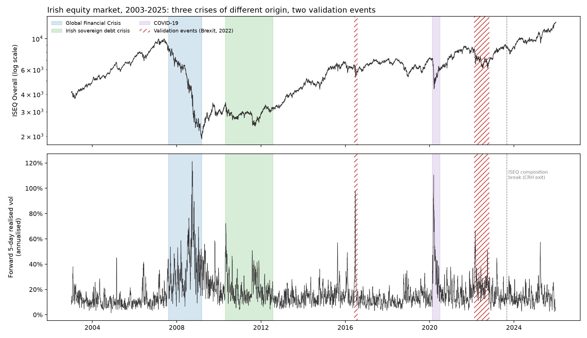

## The study in brief
| | |
|---|---|
| **Question** | Can an explainable LSTM forecast Irish stock market volatility better than GARCH and HAR — and do its SHAP explanations show how crises of different origin reached Ireland? |
| **Data** | Daily closes (Yahoo Finance) for the **ISEQ Overall** (target; domestic channel), **S&P 500** (US channel) and **DAX** (euro-area channel); FTSE 100 in one robustness run. Main sample Jan 2003 – Aug 2023 (5,243 trading days). |
| **Target** | Forward 5-day realised variance of the ISEQ. |
| **Models** | GARCH(1,1) with Student-t errors · HAR · LSTM (PyTorch; look-back 22 days, 64 units, 2 layers, 5 seeds). Walk-forward, annual refits, 4,230 out-of-sample forecast days (2007 – Aug 2023). |
| **Explanations** | Captum GradientShap, grouped by channel (domestic / US / euro), look-back lag and input type. |
| **Crises compared** | Global Financial Crisis (US origin) · Irish sovereign debt crisis (euro / domestic) · COVID-19 (global, exogenous) · validation: 2022 war/energy shock, Brexit. |
| **Hypotheses** | Fixed before any model was run: [`PREREGISTRATION.md`](PREREGISTRATION.md). The git history shows each script committed before its results. |

## Pre-registered hypotheses — status
| Hypothesis | Verdict | Evidence |
|---|---|---|
| **H1** LSTM more accurate (QLIKE) than GARCH and HAR | ❌ **Not supported** | LSTM 0.463 vs GARCH 0.380 and HAR 0.414; the LSTM is significantly *worse* (DM-HLN p = 0.003 and 0.044) |
| **H2a–c, H2e** SHAP fingerprints follow crisis origin | ⏳ running | step 07 |
| **H3** Degradation of frozen models: GFC > COVID > Irish crisis | ❌ **Not supported as ranked** | Observed GFC (4.26) > Irish (1.33) > COVID (0.74); the GFC is the largest, as predicted |
| **H4** SHAP channel rankings stable across seeds | ⏳ running | step 07 |
| **H2d** Brexit → UK channel (FTSE robustness run) | ⏳ queued | step 08 |

Negative results are reported in full, as pre-registered. Interpretation belongs in the dissertation.

## 1. Forecast accuracy (RQ1)
Mean **QLIKE** loss over walk-forward forecasts (lower is better; best per row in bold):

| Window | Days | LSTM | GARCH(1,1) | HAR | Naive (reference) |
|---|---:|---:|---:|---:|---:|
| **All test days** | 4,230 | 0.463 | **0.380** | 0.414 | 0.802 |
| Calm periods | 2,935 | 0.367 | **0.351** | 0.360 | 0.802 |
| Global Financial Crisis | 402 | 1.021 | **0.401** | 0.676 | 0.834 |
| Irish sovereign debt crisis | 574 | 0.455 | **0.374** | 0.380 | 0.802 |
| COVID-19 | 92 | **0.562** | 0.700 | 0.763 | 1.053 |
| War / energy shock 2022 | 185 | **0.264** | 0.290 | 0.282 | 0.506 |
| Brexit referendum | 42 | 2.556 | 1.941 | 1.973 | **1.264** |

Diebold–Mariano tests with the Harvey–Leybourne–Newbold correction, all test days (positive = LSTM worse):

| Loss | Comparison | Mean difference | Statistic | p-value |
|---|---|---:|---:|---:|
| QLIKE | LSTM vs GARCH | +0.083 | 3.01 | 0.003 |
| QLIKE | LSTM vs HAR | +0.049 | 2.02 | 0.044 |
| MSE | LSTM vs GARCH | > 0 | 1.93 | 0.053 |
| MSE | LSTM vs HAR | > 0 | 2.10 | 0.036 |

Benchmarks against each other: GARCH beats HAR on QLIKE (DM-HLN statistic 3.39, p = 0.0007).

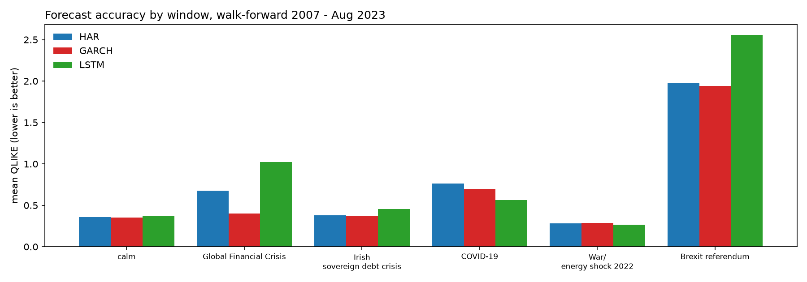

**Forecasts inside each window.** In October 2008 the LSTM forecast about 40% annualised volatility while
realised volatility reached about 120%; in COVID-19 it followed the fall in volatility faster than both benchmarks.
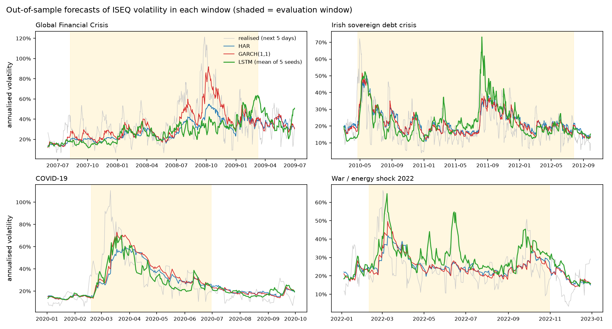

**The whole test period (benchmarks).**
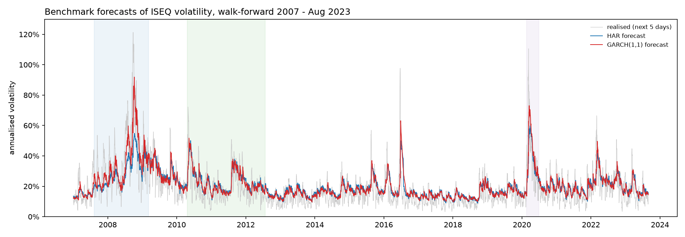

## 2. Learning from history (RQ3)
LSTMs frozen at the start of each crisis — trained only on earlier data and never refitted — compared with the
annually refitted LSTM, both relative to HAR (ratio of QLIKE; below 1 = better than HAR):

| Crisis | Trained until | Days | Frozen LSTM / HAR | Refitted LSTM / HAR |
|---|---|---:|---:|---:|
| Global Financial Crisis | 8 Aug 2007 | 402 | **4.26** | 1.51 |
| Irish sovereign debt crisis | 22 Apr 2010 | 574 | 1.33 | 1.20 |
| COVID-19 | 18 Feb 2020 | 92 | **0.74** | 0.74 |

A model that had seen only the calm 2003–07 boom failed badly in the GFC; a model that had already seen the GFC
and the Irish crisis beat HAR in COVID-19, a crisis unlike anything in its training data.

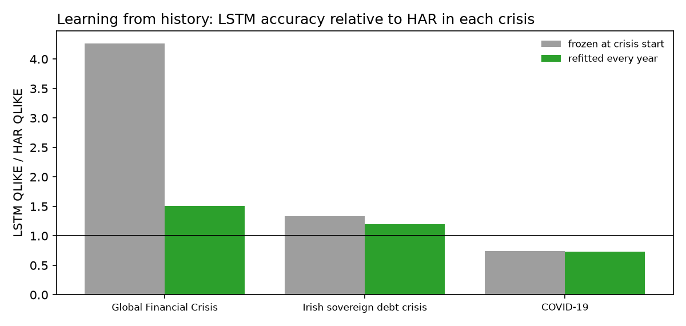

## 3. Transmission fingerprints (RQ2, RQ4) — SHAP
*Running (step 07).* Tooling check on calm 2017 days only (run before any crisis window was explained):
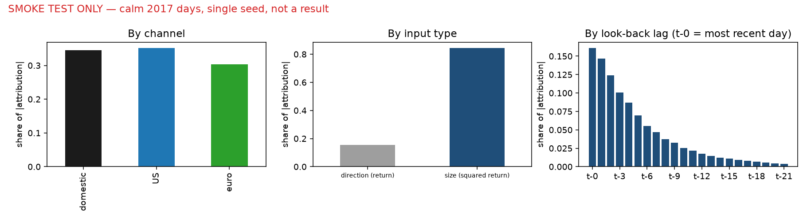

## 4. Robustness checks
*Queued (step 08):* FTSE 100 instead of DAX (with the Brexit test, H2d) · 66-day look-back · Parkinson range
volatility as the evaluation proxy · extension to Sep 2023 – Dec 2025 (after the ISEQ composition break).

## 5. Model details
**LSTM tuning** (pre-registered grid, validation years 2006 and 2007, 2 seeds; lower is better). All
configurations score above 1.0 (worse than predicting the training mean) because the validation years differ from
the calm 2003–05 training data — the same problem RQ3 measures.

| Look-back | Units | Layers | Mean validation loss |
|---:|---:|---:|---:|
| **22** | **64** | **2** | **1.307** (selected) |
| 66 | 64 | 1 | 1.324 |
| 66 | 64 | 2 | 1.350 |
| 22 | 64 | 1 | 1.357 |
| 22 | 32 | 2 | 1.363 |
| 22 | 32 | 1 | 1.384 |
| 66 | 32 | 2 | 1.384 |
| 66 | 32 | 1 | 1.432 |

**GARCH(1,1)** persistence (α + β) 0.957 – 0.999 across refits; Student-t degrees of freedom 6.2 – 8.3.
**HAR** R² rises from 0.11 (2007 refit, trained on 2003–06 only) to about 0.5 once crisis years are in the
training data. Per-year details: [`results/benchmark_parameters.csv`](results/benchmark_parameters.csv),
[`results/lstm_training_log.csv`](results/lstm_training_log.csv).

## 6. Descriptive figures (from the dataset)
**How six shocks reached the Irish market** — ISEQ vs S&P 500, FTSE 100 and DAX around each event (index = 100 the day before).
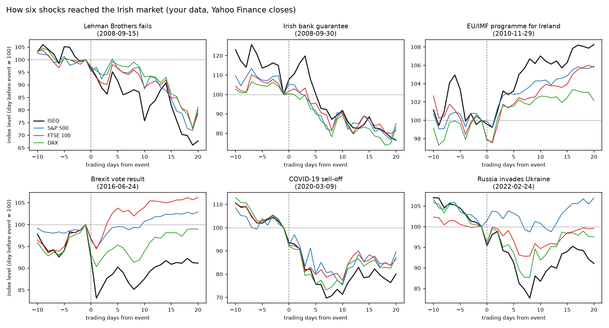

**Stability before the storm** — the calm 2003–07 boom and the 2008 crash (Minsky).
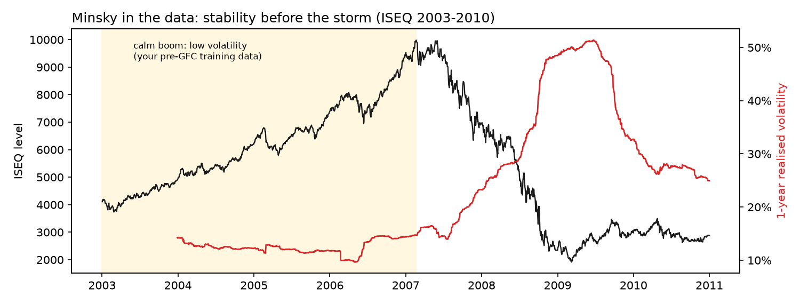

**Links between Dublin and foreign markets over time** — 250-day correlations; crisis windows shaded.
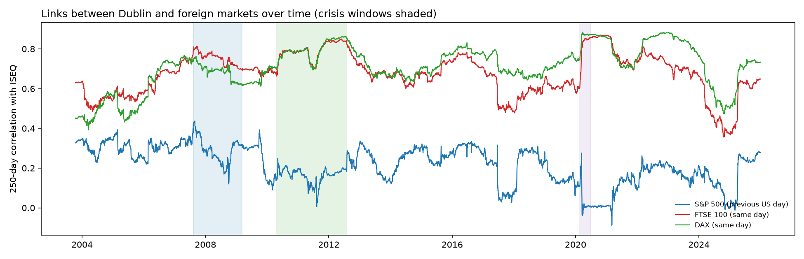

**Returns are hard to predict; volatility is not** — autocorrelation of returns vs squared returns.
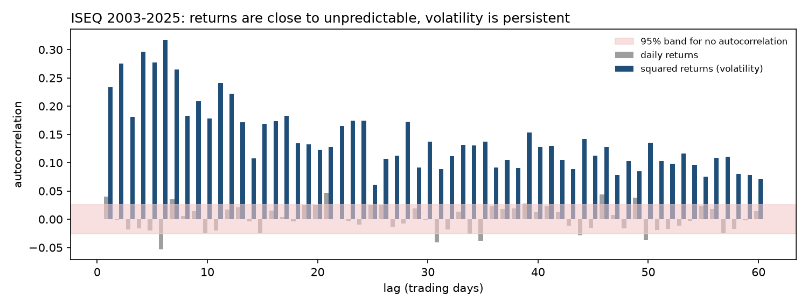

**The three HAR ingredients during the GFC** — daily, weekly and monthly volatility.
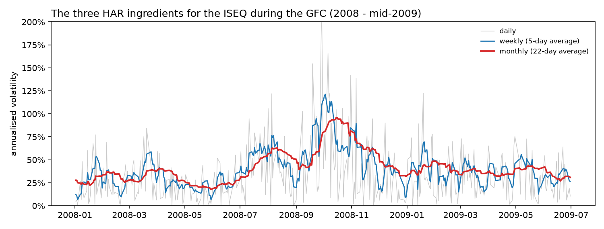

**Why the New York close of day t can be used for Dublin's day t+1** — trading hours in Irish time.
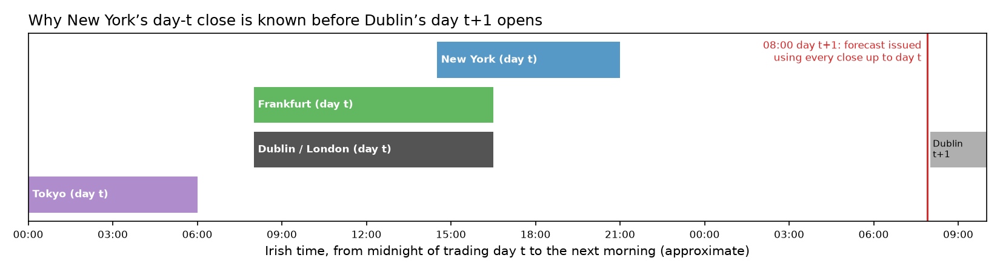

## Reproduce
```
py -3.13 -m pip install --user -r requirements.txt
cd code
py -3.13 01_data_pipeline.py      # download/cache data, build dataset, quality report, crisis chart (seconds)
py -3.13 02_handbook_figures.py   # descriptive figures
py -3.13 03_shap_smoke_test.py    # tooling check on calm 2017 days only
py -3.13 04_benchmarks.py         # HAR and GARCH walk-forward (~10 s)
py -3.13 05_lstm_walkforward.py   # tuning + 85 LSTM models (~15 min on 12 CPU threads)
py -3.13 06_evaluation.py         # H1 tests and frozen-model test (~3 min)
py -3.13 07_shap.py               # SHAP fingerprints, H2/H4 (~20 min; needs ~2 GB RAM)
py -3.13 08_robustness.py all     # robustness checks (~1 hour)
py -3.13 09_report_figures.py     # report figures from saved results
```
Raw and processed market data and trained models are not committed (Yahoo Finance terms; size); the scripts rebuild them.

## Repository layout
| Path | Contents |
|---|---|
| [`code/`](code/) | numbered scripts, run in order; `evaluation.py` (windows, losses, DM test) and `lstm_common.py` (LSTM set-up) are shared |
| [`results/`](results/) | forecast, loss, test and parameter tables ([index](results/README.md)) |
| [`figures/`](figures/) | all charts shown above |
| [`data/data_quality_report.txt`](data/data_quality_report.txt) | data checks behind each design decision |
| [`docs/`](docs/) | research plan, Chapter 2 blueprint, literature handbook (planning documents, not dissertation text) |
| [`notes/decisions.md`](notes/decisions.md) | dated design decisions with evidence |
| [`notes/ai_use.md`](notes/ai_use.md) | AI-assistance log |
| [`PREREGISTRATION.md`](PREREGISTRATION.md) | hypotheses and design |

## Roadmap
- [x] Data pipeline and quality checks (`01`)
- [x] Descriptive figures (`02`)
- [x] SHAP tooling smoke test (`03`)
- [x] Benchmarks: HAR and GARCH walk-forward (`04`)
- [x] LSTM walk-forward, 5 seeds (`05`)
- [x] Evaluation: Diebold–Mariano–HLN tests; frozen-model "learning from history" test (`06`)
- [ ] Explanations: grouped SHAP by window with bootstrap intervals; seed stability (`07`) — running
- [ ] Robustness: FTSE for DAX (incl. Brexit), look-back 66, Parkinson, post-2023 (`08`) — queued
- [ ] Pre-registration wording finalised in my own words
- [ ] Dissertation chapters and submission

## Notes
Academic work in progress. Data: Yahoo Finance via `yfinance`, for research use. AI assistance is declared in
[`notes/ai_use.md`](notes/ai_use.md); the dissertation text is written by the author.
