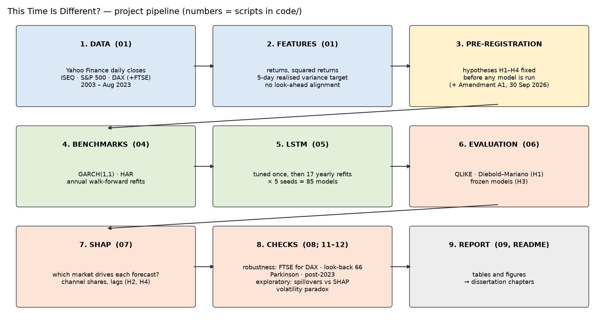
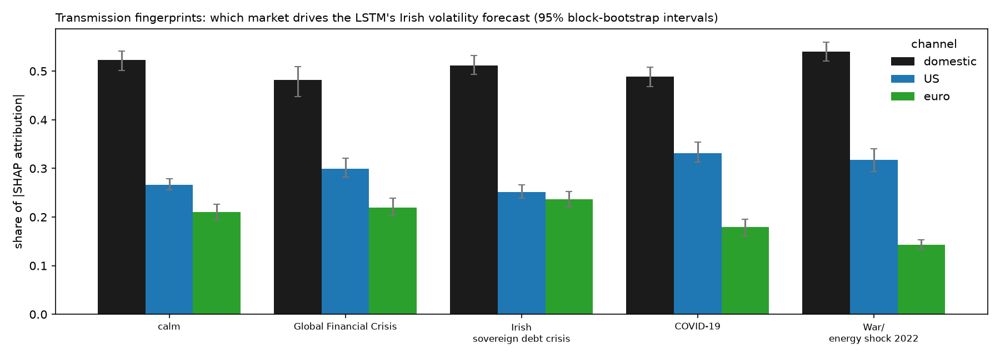
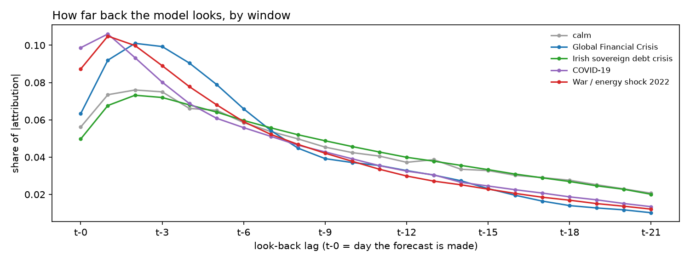
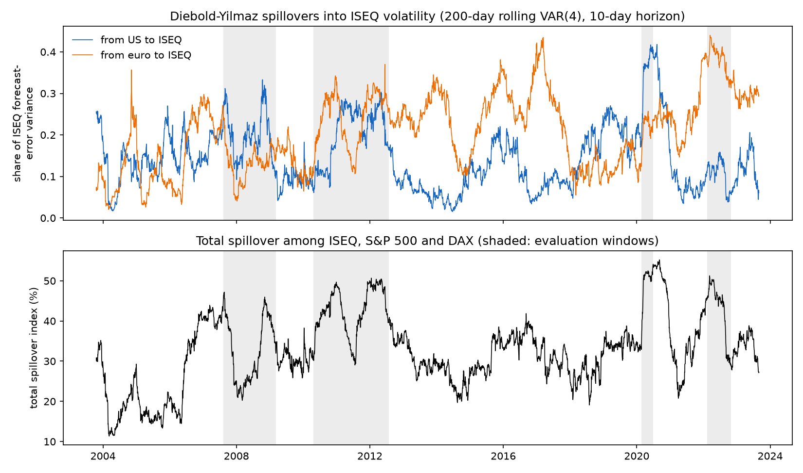
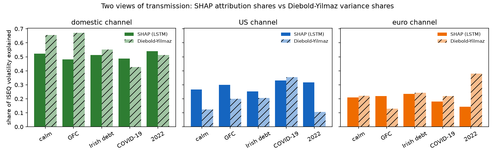
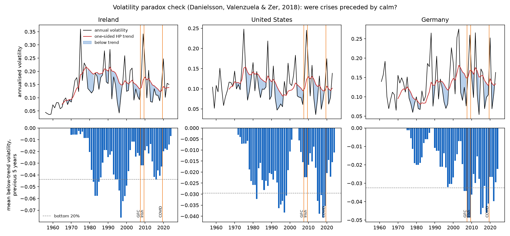

# This Time Is Different?

**Explainable deep learning of crisis transmission into Irish stock market volatility:
the Global Financial Crisis, the Irish sovereign debt crisis and COVID-19**

MSc Business Analytics dissertation · Dublin Business School · 2026 · *work in progress*


## The study in brief
| | |
|---|---|
| **Question** | Can an explainable LSTM forecast Irish stock market volatility better than GARCH and HAR — and do its SHAP explanations show how crises of different origin reached Ireland? |
| **Data** | Daily closes (Yahoo Finance) for the **ISEQ Overall** (target; domestic channel), **S&P 500** (US channel) and **DAX** (euro-area channel); FTSE 100 in one robustness run. Main sample Jan 2003 – Aug 2023 (5,243 trading days). |
| **Target** | Forward 5-day realised variance of the ISEQ. |
| **Models** | GARCH(1,1) with Student-t errors · HAR · LSTM (PyTorch; look-back 22 days, 64 units, 2 layers, 5 seeds). Walk-forward, annual refits, 4,230 out-of-sample forecast days (2007 – Aug 2023). |
| **Explanations** | Captum GradientShap, grouped by channel (domestic / US / euro), look-back lag and input type. |
| **Crises compared** | Global Financial Crisis (US origin) · Irish sovereign debt crisis (euro / domestic) · COVID-19 (global, exogenous) · validation: 2022 war/energy shock, Brexit. |
| **Hypotheses** | Fixed before any model was run: [`PREREGISTRATION.md`](PREREGISTRATION.md). The git history shows each script committed before its results. |



New to the project? Read the **[Project Handbook](docs/Project_Handbook.docx)** — every term, method, script,
graph and result explained in plain language.

## Pre-registered hypotheses — status
| Hypothesis | Verdict | Evidence |
|---|---|---|
| **H1** LSTM more accurate (QLIKE) than GARCH and HAR | ❌ **Not supported** | LSTM 0.463 vs GARCH 0.380 and HAR 0.414; the LSTM is significantly *worse* (DM-HLN p = 0.003 and 0.044) |
| **H2a** GFC: US share rises most; domestic above calm | ❌ **Not supported** (partly) | US share rises most (0.266 → 0.299, interval above calm) but the domestic share falls (0.523 → 0.482) |
| **H2b** Irish crisis: euro and domestic rise; US below GFC | ❌ **Not supported** (partly) | Euro rises (0.211 → 0.236) and US is below its GFC level (0.252 < 0.299), but domestic does not rise (0.512) |
| **H2c** COVID-19: shares move towards equality | ✅ **Supported, narrowly** | Max–min spread 0.308 vs 0.312 in calm periods — a very small difference |
| **H2e** 2022 shock: euro share rises | ❌ **Not supported** | Euro share *falls* (0.211 → 0.143); the US share rises (0.317) |
| **H3** Degradation of frozen models: GFC > COVID > Irish crisis | ❌ **Not supported as ranked** | Observed GFC (4.26) > Irish (1.33) > COVID (0.74); the GFC is the largest, as predicted |
| **H4** SHAP channel rankings stable across seeds (Spearman ≥ 0.8) | ❌ **Not supported** | 1.0 in calm and 2022, 0.8 in COVID, 0.7 in the GFC and the Irish crisis |
| **H2d** Brexit → UK channel (FTSE robustness run) | ⏳ running | step 08 |

Negative results are reported in full, as pre-registered. Interpretation belongs in the dissertation.

## 1. Forecast accuracy (RQ1)
Mean **QLIKE** loss over walk-forward forecasts (lower is better; best per row in bold):

| Window | Days | LSTM | GARCH(1,1) | HAR | Naive (reference) |
|---|---:|---:|---:|---:|---:|
| **All test days** | 4,230 | 0.463 | **0.380** | 0.414 | 0.802 |
| Calm periods | 2,935 | 0.367 | **0.351** | 0.360 | 0.802 |
| Global Financial Crisis | 402 | 1.021 | **0.401** | 0.676 | 0.834 |
| Irish sovereign debt crisis | 574 | 0.455 | **0.374** | 0.380 | 0.802 |
| COVID-19 | 92 | **0.562** | 0.700 | 0.763 | 1.053 |
| War / energy shock 2022 | 185 | **0.264** | 0.290 | 0.282 | 0.506 |
| Brexit referendum | 42 | 2.556 | 1.941 | 1.973 | **1.264** |

Diebold–Mariano tests with the Harvey–Leybourne–Newbold correction, all test days (positive = LSTM worse):

| Loss | Comparison | Mean difference | Statistic | p-value |
|---|---|---:|---:|---:|
| QLIKE | LSTM vs GARCH | +0.083 | 3.01 | 0.003 |
| QLIKE | LSTM vs HAR | +0.049 | 2.02 | 0.044 |
| MSE | LSTM vs GARCH | > 0 | 1.93 | 0.053 |
| MSE | LSTM vs HAR | > 0 | 2.10 | 0.036 |

Benchmarks against each other: GARCH beats HAR on QLIKE (DM-HLN statistic 3.39, p = 0.0007).


**Forecasts inside each window.** In October 2008 the LSTM forecast about 40% annualised volatility while
realised volatility reached about 120%; in COVID-19 it followed the fall in volatility faster than both benchmarks.


**The whole test period (benchmarks).**


## 2. Learning from history (RQ3)
LSTMs frozen at the start of each crisis — trained only on earlier data and never refitted — compared with the
annually refitted LSTM, both relative to HAR (ratio of QLIKE; below 1 = better than HAR):

| Crisis | Trained until | Days | Frozen LSTM / HAR | Refitted LSTM / HAR |
|---|---|---:|---:|---:|
| Global Financial Crisis | 8 Aug 2007 | 402 | **4.26** | 1.51 |
| Irish sovereign debt crisis | 22 Apr 2010 | 574 | 1.33 | 1.20 |
| COVID-19 | 18 Feb 2020 | 92 | **0.74** | 0.74 |

A model that had seen only the calm 2003–07 boom failed badly in the GFC; a model that had already seen the GFC
and the Irish crisis beat HAR in COVID-19, a crisis unlike anything in its training data.


## 3. Transmission fingerprints (RQ2, RQ4) — SHAP
Captum GradientShap on the model that made each forecast, for all 5 seeds: every day in each crisis window plus
every 10th calm day (1,547 days × 5 seeds; 1,024 samples; attributions add up to the forecast within 0.02 on
average). **Share of total |attribution|** by channel, with 95% block-bootstrap intervals:

| Window | Domestic (ISEQ) | US (S&P 500) | Euro (DAX) |
|---|---|---|---|
| Calm | 0.523 [0.502, 0.541] | 0.266 [0.256, 0.279] | 0.211 [0.195, 0.226] |
| Global Financial Crisis | 0.482 [0.448, 0.509] | **0.299** [0.282, 0.321] | 0.219 [0.203, 0.238] |
| Irish sovereign debt crisis | 0.512 [0.493, 0.532] | 0.252 [0.239, 0.266] | **0.236** [0.220, 0.253] |
| COVID-19 | 0.488 [0.468, 0.508] | **0.332** [0.313, 0.355] | 0.180 [0.161, 0.196] |
| War / energy shock 2022 | 0.540 [0.521, 0.560] | **0.317** [0.293, 0.341] | 0.143 [0.134, 0.154] |

Bold = interval lies above the calm-period share.



**How far back the model looks.** In the fast crises (GFC, COVID-19, 2022) attribution concentrates on the last
1–5 days; in the slow-burning Irish sovereign debt crisis the profile is the same as in calm periods.


**Direction vs size of moves** (share of |attribution| on returns vs squared returns):

| Window | Size (squared returns) | Direction (returns) |
|---|---:|---:|
| Calm | 0.590 | 0.410 |
| Global Financial Crisis | 0.380 | **0.620** |
| Irish sovereign debt crisis | 0.655 | 0.345 |
| COVID-19 | 0.510 | 0.490 |
| War / energy shock 2022 | 0.561 | 0.439 |

**Stability across the 5 seeds (RQ4)** — mean pairwise Spearman correlation of channel shares (3 channels) and
of input shares (6 inputs):

| Window | Channels (mean) | Channels (min) | 6 inputs (mean) |
|---|---:|---:|---:|
| Calm | 1.0 | 1.0 | 0.81 |
| Global Financial Crisis | 0.7 | 0.5 | 0.62 |
| Irish sovereign debt crisis | 0.7 | 0.5 | 0.83 |
| COVID-19 | 0.8 | 0.5 | 0.82 |
| War / energy shock 2022 | 1.0 | 1.0 | 0.87 |

Full tables: [`results/shap_channel_shares.csv`](results/shap_channel_shares.csv),
[`shap_lags.csv`](results/shap_lags.csv), [`shap_input_types.csv`](results/shap_input_types.csv),
[`shap_stability.csv`](results/shap_stability.csv), [`shap_by_seed.csv`](results/shap_by_seed.csv).

## 4. Robustness checks
**Parkinson range volatility as the evaluation proxy** (scaled to close-to-close variance using 2003–2006 only;
scale factor 1.001). Mean QLIKE:

| Window | LSTM | GARCH | HAR |
|---|---:|---:|---:|
| **All test days** | 0.295 | **0.237** | 0.270 |
| Calm | 0.224 | **0.208** | 0.229 |
| Global Financial Crisis | 0.638 | **0.256** | 0.416 |
| Irish sovereign debt crisis | 0.276 | **0.232** | 0.255 |
| COVID-19 | **0.315** | 0.509 | 0.525 |
| War / energy shock 2022 | 0.250 | **0.161** | 0.163 |

LSTM vs GARCH: DM-HLN statistic 3.26, p = 0.001 (LSTM worse); LSTM vs HAR: 1.50, p = 0.13 (no significant
difference). GARCH remains the most accurate model overall; the LSTM remains the best in COVID-19.

*Still to run (step 08; the first attempt was stopped at 58/85 FTSE models):* FTSE 100 instead of DAX (with the
Brexit test, H2d) · 66-day look-back · extension to Sep 2023 – Dec 2025 (after the ISEQ composition break).

## 5. Exploratory extensions (Amendment A1)
*Chosen after the main results were known. The specification was committed before either analysis was run
(commit 9c89f79, [`PREREGISTRATION.md`](PREREGISTRATION.md) → Amendments). These results cannot confirm or rescue
any hypothesis.*

**E1: econometric spillovers vs SHAP** (Diebold & Yilmaz, 2012). Method: VAR(4) on log 5-day realised variance
of ISEQ, S&P 500 and DAX, fitted on 200-day rolling windows, with a generalized forecast-error variance
decomposition at a 10-day horizon. The ISEQ row is averaged over the same days that were explained with SHAP.

| Window | SHAP share: domestic / US / euro | Diebold–Yilmaz share: own / from US / from euro |
|---|---|---|
| Calm | 0.523 / 0.266 / 0.211 | 0.655 / 0.124 / 0.221 |
| Global Financial Crisis | 0.482 / 0.299 / 0.219 | 0.672 / 0.199 / 0.129 |
| Irish sovereign debt crisis | 0.512 / 0.252 / 0.236 | 0.551 / 0.206 / 0.243 |
| COVID-19 | 0.488 / 0.332 / 0.180 | 0.427 / 0.354 / 0.219 |
| War / energy shock 2022 | 0.540 / 0.317 / 0.143 | 0.512 / 0.107 / 0.381 |

- **Agreement between the two measures:** weak.
  - The change from calm has the same sign in **4 of 8** window × foreign-channel cases.
  - The US-vs-euro ranking matches in **2 of 5** windows.
  - All sensitivity runs give the same picture (sign 3–4 of 8; ranking 0–2 of 5).
- **Where they agree:** both show the US share rising in the GFC and rising most in COVID-19.
- **Where they differ most:** 2022. The spillover measure's euro share rises to 0.381 (the direction pre-registered in H2e), while the SHAP euro share falls.
- **Full sample:**
  - The total spillover index is 34.0%.
  - The ISEQ is a net receiver (−8.4); the US is a net transmitter (+7.7).




**E2: volatility paradox** (Danielsson, Valenzuela & Zer, 2018). Data: OECD monthly share prices from FRED;
Ireland (= ISEQ) from 1955. The measure is the mean below-trend volatility over the five July–June years before
each window (one-sided HP trend, λ = 5,000). The percentile in brackets is within the same market's own history;
the bottom 20% counts as "unusually calm".

| Market | GFC (2003–07) | Irish debt crisis (2005–09) | COVID-19 (2015–19) |
|---|---|---|---|
| Ireland | −0.032 (40th) | −0.019 (62nd) | −0.020 (60th) |
| United States | −0.022 (42nd) | −0.017 (60th) | −0.020 (49th) |
| Germany | **−0.049 (4th)** | **−0.036 (16th)** | −0.027 (40th) |

- **Before the GFC:**
  - Only Germany meets the "unusually calm" rule.
  - Ireland was below its trend in four of the five years (2004–07), but those dips were not unusual by its own 1970–2024 history.
  - So the stated expectation for Ireland and the US is not met.
- **Before COVID-19:** no market was unusually calm, as expected.
- **Cross-check:** FRED and Yahoo annual volatility correlate 0.89–0.91 (2004–23). FRED levels are lower because monthly averaging smooths returns.



## 6. Model details
**LSTM tuning** (pre-registered grid, validation years 2006 and 2007, 2 seeds; lower is better). All
configurations score above 1.0 (worse than predicting the training mean) because the validation years differ from
the calm 2003–05 training data — the same problem RQ3 measures.

| Look-back | Units | Layers | Mean validation loss |
|---:|---:|---:|---:|
| **22** | **64** | **2** | **1.307** (selected) |
| 66 | 64 | 1 | 1.324 |
| 66 | 64 | 2 | 1.350 |
| 22 | 64 | 1 | 1.357 |
| 22 | 32 | 2 | 1.363 |
| 22 | 32 | 1 | 1.384 |
| 66 | 32 | 2 | 1.384 |
| 66 | 32 | 1 | 1.432 |

**GARCH(1,1)** persistence (α + β) 0.957 – 0.999 across refits; Student-t degrees of freedom 6.2 – 8.3.
**HAR** R² rises from 0.11 (2007 refit, trained on 2003–06 only) to about 0.5 once crisis years are in the
training data. Per-year details: [`results/benchmark_parameters.csv`](results/benchmark_parameters.csv),
[`results/lstm_training_log.csv`](results/lstm_training_log.csv).

## 7. Descriptive figures (from the dataset)
**How six shocks reached the Irish market** — ISEQ vs S&P 500, FTSE 100 and DAX around each event (index = 100 the day before).


**Stability before the storm** — the calm 2003–07 boom and the 2008 crash (Minsky).


**Links between Dublin and foreign markets over time** — 250-day correlations; crisis windows shaded.


**Returns are hard to predict; volatility is not** — autocorrelation of returns vs squared returns.


**The three HAR ingredients during the GFC** — daily, weekly and monthly volatility.


**Why the New York close of day t can be used for Dublin's day t+1** — trading hours in Irish time.


## Reproduce
```
py -3.13 -m pip install --user -r requirements.txt
cd code
py -3.13 01_data_pipeline.py      # download/cache data, build dataset, quality report, crisis chart (seconds)
py -3.13 02_handbook_figures.py   # descriptive figures
py -3.13 03_shap_smoke_test.py    # tooling check on calm 2017 days only
py -3.13 04_benchmarks.py         # HAR and GARCH walk-forward (~10 s)
py -3.13 05_lstm_walkforward.py   # tuning + 85 LSTM models (~15 min on 12 CPU threads)
py -3.13 06_evaluation.py         # H1 tests and frozen-model test (~3 min)
py -3.13 07_shap.py               # SHAP fingerprints, H2/H4 (~21 min; ~2 GB RAM)
py -3.13 08_robustness.py all     # robustness checks (~1 hour)
py -3.13 09_report_figures.py     # report figures from saved results
py -3.13 11_connectedness.py      # exploratory E1: Diebold-Yilmaz spillovers vs SHAP (seconds)
py -3.13 12_volatility_paradox.py # exploratory E2: volatility paradox, FRED data from 1955 (seconds)
```
Raw and processed market data and trained models are not committed (Yahoo Finance terms; size); the scripts rebuild them.

**Google Colab:** [`colab/This_Time_Is_Different_Colab.ipynb`](colab/This_Time_Is_Different_Colab.ipynb) runs the whole pipeline as one step-by-step notebook, laid out like the MSc machine-learning module notebooks (quick mode about 5–10 minutes; see [`colab/README.md`](colab/README.md)).

## Repository layout
| Path | Contents |
|---|---|
| [`code/`](code/) | numbered scripts, run in order; `evaluation.py` (windows, losses, DM test) and `lstm_common.py` (LSTM set-up) are shared |
| [`results/`](results/) | forecast, loss, test and parameter tables ([index](results/README.md)) |
| [`figures/`](figures/) | all charts shown above |
| [`data/data_quality_report.txt`](data/data_quality_report.txt) | data checks behind each design decision |
| [`docs/`](docs/) | project handbook, research plan, Chapter 2 blueprint, literature handbook (study and planning documents, not dissertation text) |
| [`notes/decisions.md`](notes/decisions.md) | dated design decisions with evidence |
| [`colab/`](colab/) | the whole project as one Google Colab notebook (+ builder script) |
| [`notes/ai_use.md`](notes/ai_use.md) | AI-assistance log |
| [`PREREGISTRATION.md`](PREREGISTRATION.md) | hypotheses and design |

## Roadmap
- [x] Data pipeline and quality checks (`01`)
- [x] Descriptive figures (`02`)
- [x] SHAP tooling smoke test (`03`)
- [x] Benchmarks: HAR and GARCH walk-forward (`04`)
- [x] LSTM walk-forward, 5 seeds (`05`)
- [x] Evaluation: Diebold–Mariano–HLN tests; frozen-model "learning from history" test (`06`)
- [x] Explanations: grouped SHAP by window with bootstrap intervals; seed stability (`07`)
- [ ] Robustness: Parkinson ✅ · FTSE for DAX (incl. Brexit) · look-back 66 · post-2023 (`08`) — to run
- [x] Project handbook (`docs/Project_Handbook.docx`)
- [x] Exploratory extensions (Amendment A1): spillovers vs SHAP (`11`), volatility paradox (`12`)
- [ ] Pre-registration wording finalised in my own words
- [ ] Dissertation chapters and submission

## Notes
Academic work in progress. Data: Yahoo Finance via `yfinance`, for research use. AI assistance is declared in
[`notes/ai_use.md`](notes/ai_use.md); the dissertation text is written by the author.
