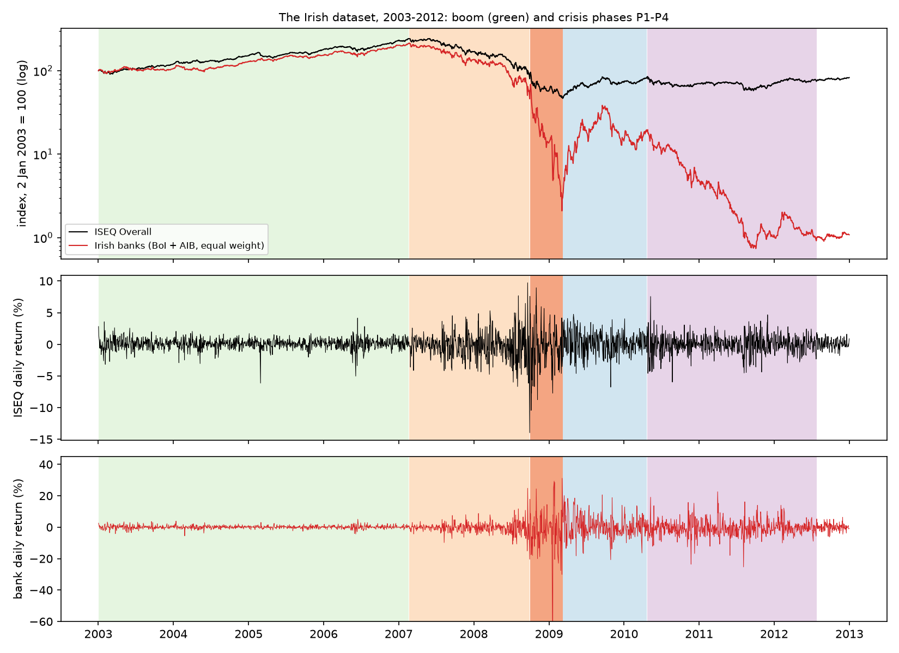
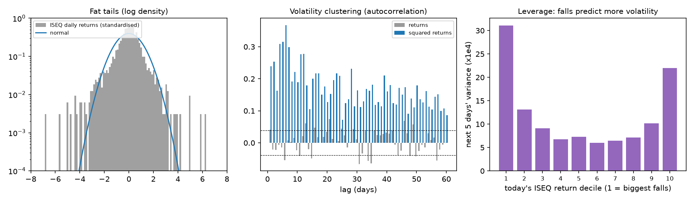
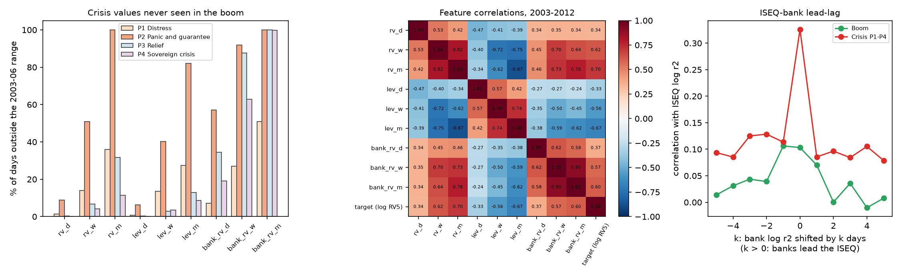

# Irish Dataset Handbook

*The data behind the Irish focus (Amendment A6): sources, background, construction, quality checks, descriptive
statistics by phase, features and limitations.*

> **Status.** Study notes prepared with AI assistance on 2 Oct 2026 (see `notes/ai_use.md`). **Not dissertation
> text.** Write your Data chapter in your own words and check every external fact against the sources in section 13
> before citing it. All numbers below come from `code/19_irish_data_profile.py` (descriptive only) and
> `code/17_irish_focus.py`. Tables are in `results/irish_data_*.csv`.

## Contents
1. Why this dataset
2. The Irish market: background you need
3. Sources
4. What was searched for and not used
5. How the dataset is built, step by step
6. Quality checks
7. Descriptive statistics by phase
8. Stylised facts, tested
9. The target variable
10. The largest moves
11. The features in depth
12. The ISEQ and the banks
13. Limitations, reproduction and sources

---

## 1. Why this dataset
The dissertation reads the **Irish financial crisis of 2007–2012** as one Minsky–Kindleberger episode: a credit boom,
then distress, panic, a lender of last resort, a relief rally and a sovereign crisis. It uses **Irish data only**.

Two series carry the story:
- **The ISEQ Overall index** — the market whose volatility is forecast.
- **Two Irish banks, Bank of Ireland and AIB** — where the crisis began. In June 2007 AIB, Anglo Irish Bank and Bank
  of Ireland together made up **almost 37% of the ISEQ** (Irish Times, 2 June 2007). A banking bust was therefore
  also an index bust.

## 2. The Irish market: background you need

**The exchange**
- **Euronext Dublin**, formerly the Irish Stock Exchange (ISE), traces its history to 1793. It has been part of
  Euronext since 2018 — confirm the date in the Euronext Dublin source (§13).
- **Main Securities Market vs ESM.**
  - Large companies list on the Main Securities Market.
  - The Enterprise Securities Market (ESM) is the growth market for smaller firms.
  - The ISEQ Overall covers main-market shares. Check the current rulebook for the exact eligibility rules.

**The index**
- The **ISEQ Overall** is a capitalisation-weighted index of Irish equities. Euronext data start on **4 January 1988**;
  the base value is usually given as 1,000 (confirm in the Euronext rulebook).
- In 2007 the ISE planned to move the index to **free-float weighting**, which leaves out strategic, non-tradeable
  holdings (Irish Times, 2 June 2007).
- **ISEQ 20:** the 20 largest and most traded shares; started 31 Dec 2004 at 1,000. It is not used here.
- The Yahoo series `^ISEQ` is the ISEQ Overall **price** index: dividends are not reinvested.

**What happened to the banks — these events shape the data:**

| Date | Event | Effect on the data |
|---|---|---|
| Jun 2007 | AIB, Anglo Irish and Bank of Ireland ≈ 37% of the ISEQ | bank stress moves the whole index |
| 30 Sep 2008 | Irish government guarantee of the banks' liabilities | ISEQ −14.0% on 29 Sep and +7.6% on 30 Sep (in the data) |
| Jan 2009 | Anglo Irish Bank nationalised; its shares cancelled | Anglo leaves the index; no Yahoo series (survivorship) |
| 2010 | Bank of Ireland rights issue at €0.55 (state-underwritten) | partly mechanical price fall |
| 25 Jan 2011 | AIB leaves the Main Securities Market for the ESM | AIB no longer in the main-market index; still an Irish bank-stress signal |
| Jul 2011 | AIB places €5bn of new shares with the state (NPRFC) at €0.01; state owns 99.8% | AIB price collapses mechanically; thin trading afterwards |
| Jul 2011 | Bank of Ireland 18-for-5 rights issue (€1.91bn) | mechanical price fall |
| Dec 2015 | AIB 1-for-250 share consolidation | outside the window; recorded by Yahoo as a split (0.004), so returns are unaffected |
| 2023–24 | CRH, Flutter and Smurfit leave the ISEQ | outside the Irish-focus window (ends 2012) |

## 3. Sources

| Series | Ticker | Provider | Fields used | Period used | File (not committed: Yahoo terms) |
|---|---|---|---|---|---|
| ISEQ Overall | `^ISEQ` | Yahoo Finance | Close (Open/High/Low only for checks) | Oct 2002 – Dec 2012 | `data/raw/ISEQ.csv` |
| Bank of Ireland | `BIRG.IR` | Yahoo Finance | Adjusted close | Oct 2002 – Dec 2012 | `data/raw/BIRG_IR.csv` |
| AIB | `A5G.IR` | Yahoo Finance | Adjusted close | Oct 2002 – Dec 2012 | `data/raw/A5G_IR.csv` |

- The tickers belong to today's holding companies. Yahoo stores the history of the earlier listed bank shares under
  them.
- **Adjusted close** corrects for dividends and splits. It does **not** fully correct for rights issues or the 2011 AIB
  placing (see §6).

## 4. What was searched for and not used (2 Oct 2026)

| Candidate | Result | Why not used |
|---|---|---|
| ISEQ datasets on GitHub / Kaggle | only Yahoo-based pulls | nothing better than the source already used |
| PTSB (`PTSB.IR`) | available | stale: 51% of 2010–12 days show no price change; 13% zero-volume days |
| Anglo Irish Bank, Irish Nationwide | no daily series | failed or mutual; shares cancelled |
| Daily Irish 10-year government bond yield | Eurostat daily series no longer published; no daily ECB series found | only monthly yields are free (FRED, ECB) |
| Irish Economic Policy Uncertainty index | monthly | too coarse for 5-day forecasts |
| Intraday ISEQ prices (true realised volatility) | not free | Oxford-Man library did not cover the ISEQ |
| ISEQ trading volume (Yahoo) | 18% zero-volume days | unreliable; not used |

## 5. How the dataset is built, step by step
1. **Download and cache:** ISEQ, Bank of Ireland and AIB daily prices from Yahoo (scripts 01 and 17). The trading date
   is kept and the time zone removed.
2. **ISEQ return:** rₜ = ln(Pₜ / Pₜ₋₁), from closing prices only. Opens are not used, because Yahoo's ISEQ opens are
   often stale (§6).
3. **Target:** RV5ₜ = r²ₜ₊₁ + … + r²ₜ₊₅, the realised variance of the next 5 days. Models forecast ln RV5ₜ, and
   forecasts are converted back with a smearing factor (Duan, 1983).
4. **Bank return:** bₜ = ½[ln(BoIₜ/BoIₜ₋₁) + ln(AIBₜ/AIBₜ₋₁)], computed on the banks' own dates. It is then joined to
   the ISEQ dates with `merge_asof` (backward), so only information up to day *t* is used.
5. **Features** (§11): HAR terms (daily, weekly = 5-day mean, monthly = 22-day mean of r²), leverage terms min(r, 0)
   and bank HAR terms. Squared terms go into logs with a floor of 10⁻⁸ (to avoid ln 0).
6. **LSTM inputs:** the daily pairs (rₜ, ln r²ₜ) for the ISEQ, plus (bₜ, ln b²ₜ) for the banks, over 22-day windows.
   They are scaled with means and standard deviations from the fitting days only.
7. **Phases:** dates from the Irish timeline (Literature Handbook, section B).
8. **Walk-forward splits:** each test year Y uses fitting days up to the end of Y−2 and validation days in Y−1. The last
   5 days of each block are dropped, because their 5-day targets would overlap the next block.

| Test year | Fitting days | Fitting period | Validation days | Test days |
|---|---|---|---|---|
| 2007 | 734 | 31 Jan 2003 – 21 Dec 2005 | 248 | 254 |
| 2008 | 987 | 31 Jan 2003 – 20 Dec 2006 | 249 | 254 |
| 2009 | 1,241 | 31 Jan 2003 – 20 Dec 2007 | 249 | 251 |
| 2010 | 1,495 | 31 Jan 2003 – 22 Dec 2008 | 246 | 254 |
| 2011 | 1,746 | 31 Jan 2003 – 22 Dec 2009 | 249 | 253 |
| 2012 | 2,000 | 31 Jan 2003 – 22 Dec 2010 | 248 | 254 |

Fitting starts on 31 Jan 2003 because the 22-day features need 21 earlier days inside the sample.

## 6. Quality checks

**Coverage, 2003–2012**

| Series | Days | Missing prices | Duplicated dates | Zero-return days | Zero-volume days | Dates not in the ISEQ calendar |
|---|---|---|---|---|---|---|
| ISEQ | 2,533 | 0 | 0 | 0.04% | 17.8% | — |
| Bank of Ireland | 2,561 | 0 | 0 | 14.1% | 1.2% | 28 |
| AIB | 2,561 | 0 | 0 | 14.0% | 1.2% | 28 |

**Quality by year (% of days)**

| Year | ISEQ open = previous close | BoI zero return | AIB zero return |
|---|---|---|---|
| 2003 | 3.6 | 21.8 | 18.8 |
| 2004 | 5.1 | 24.8 | 20.2 |
| 2005 | 9.5 | 20.4 | 21.2 |
| 2006 | 15.0 | 26.7 | 26.0 |
| 2007 | 16.5 | 17.3 | 19.7 |
| 2008 | 43.3 | 1.6 | 1.6 |
| 2009 | 47.4 | 0.8 | 1.2 |
| 2010 | 44.9 | 2.8 | 2.0 |
| 2011 | 40.3 | 7.1 | 7.9 |
| 2012 | 34.3 | 16.9 | 21.3 |

**What these checks mean**
1. **ISEQ closes are clean** (no gaps, no stale closes).
   - Opens are often just the previous close (up to 47% of days). That is why the study uses close-to-close returns,
     not range or open-based estimators such as Garman–Klass.
   - ISEQ volume is unreliable and is not used.
2. **The bank series are stale in the boom:** 20–27% of 2003–07 days show no change.
   - Part of this comes from **Irish holiday rows**. Yahoo's bank series has 28 extra dates when the ISEQ was closed
     (Good Friday, Easter Monday, bank holidays, Christmas; 2003–06 plus 1 May 2008), with unchanged prices.
   - So boom-period bank volatility is slightly understated. Bank features therefore look calmer in training than
     they really were.
   - In the crisis (2008–10) the bank series trade almost every day.
3. **Corporate actions.**
   - Yahoo records AIB's 2015 consolidation as a split (0.004), so returns are unaffected.
   - It also records an unexplained "split" of 1.026 for Bank of Ireland on 21 Nov 2007.
   - Rights issues (BoI 2010, 2011) and AIB's €0.01 placing (Jul 2011) are **not** neutralised, so some 2010–11 bank
     falls are partly mechanical. One example is AIB −43.8% (log) on 5 Aug 2011.
4. **Survivorship.** The bank index uses the two banks that survived as listed companies. Anglo Irish (nationalised,
   shares cancelled) and Irish Nationwide (a mutual) are missing, and PTSB is excluded as stale. So the bank index
   **understates** the banking collapse.

## 7. Descriptive statistics by phase
Returns are daily log returns. "Mean" and "volatility" are annualised (×252 and ×√252).

**ISEQ**

| Period | Days | Mean (% a year) | Volatility (% a year) | Skew | Excess kurtosis | Worst day | Best day | Max drawdown | Corr. with banks |
|---|---|---|---|---|---|---|---|---|---|
| Boom (2003 – 19 Feb 2007) | 1,048 | +22.0 | 13.2 | −0.71 | 5.71 | −6.1% (28 Feb 2005) | +4.2% (15 Jun 2006) | −14.7% | 0.41 |
| P1 Distress | 408 | −68.3 | 34.2 | −0.29 | 5.11 | −14.0% (29 Sep 2008) | +9.7% (19 Sep 2008) | −67.0% | 0.85 |
| P2 Panic and guarantee | 112 | −121.7 | 53.1 | −0.17 | 0.73 | −10.4% (6 Oct 2008) | +8.9% (31 Oct 2008) | −51.4% | 0.54 |
| P3 Relief | 281 | +50.5 | 27.1 | −0.24 | 0.70 | −6.7% (28 Oct 2009) | +4.8% (30 Apr 2009) | −19.5% | 0.62 |
| P4 Sovereign crisis | 574 | −3.3 | 23.3 | −0.13 | 2.08 | −6.0% (24 Aug 2010) | +7.6% (10 May 2010) | −32.3% | 0.54 |
| Whole crisis | 1,375 | −21.3 | 31.0 | −0.39 | 4.41 | −14.0% | +9.7% | −80.8% | 0.58 |

**Irish banks (Bank of Ireland + AIB, equal weight)**

| Period | Mean (% a year) | Volatility (% a year) | Skew | Excess kurtosis | Worst day | Best day | Max drawdown |
|---|---|---|---|---|---|---|---|
| Boom | +18.7 | 16.0 | −0.13 | 3.20 | −5.5% (25 Feb 2004) | +5.1% (16 Jun 2006) | −16.0% |
| P1 Distress | −94.2 | 53.4 | 0.41 | 11.78 | −20.4% (29 Sep 2008) | +24.8% (19 Sep 2008) | −78.5% |
| P2 Panic and guarantee | −610.3 | 214.9 | −1.65 | 10.67 | −83.7% (19 Jan 2009) | +31.1% (6 Mar 2009) | −97.0% |
| P3 Relief | +162.7 | 107.4 | 0.25 | 0.79 | −20.7% (28 Oct 2009) | +20.6% (17 Sep 2009) | −70.7% |
| P4 Sovereign crisis | −128.5 | 77.2 | 0.17 | 3.96 | −25.3% (5 Aug 2011) | +22.6% (1 Apr 2011) | −96.2% |
| Whole crisis | −98.1 | 97.7 | −1.57 | 27.44 | −83.7% | +31.1% | −99.7% |

**What to see**
- **The boom was calm** (13% volatility) while prices rose 22% a year in log terms: Minsky's tranquillity.
- **Volatility rises fourfold into the panic** (53%).
- **The banks' volatility is 1.6 times the index's in distress and 3–4 times from the panic on.** The banks lost 99.7%
  from peak to trough; this includes the mechanical dilution of the 2010–11 recapitalisations.
- **The ISEQ–bank correlation jumps from 0.41 in the boom to 0.85 in distress.** Correlations rise mechanically when
  volatility rises (Forbes & Rigobon, 2002), so read this as heightened co-movement, not proof of contagion.



## 8. Stylised facts, tested
All p-values are rounded; "0.000" means below 0.0005.

| Test (ISEQ) | Boom | P1 | P2 | P3 | P4 | Reading |
|---|---|---|---|---|---|---|
| Jarque–Bera (normality) p | 0.000 | 0.000 | 0.225 | 0.015 | 0.000 | fat tails, except within the short panic, where everything is wild |
| Ljung–Box Q(10), returns p | 0.370 | 0.009 | 0.052 | 0.718 | 0.302 | returns are close to unpredictable (some autocorrelation in distress) |
| Ljung–Box Q(10), squared returns p | 0.000 | 0.000 | 0.011 | 0.006 | 0.000 | **volatility clusters**: big moves follow big moves |
| ARCH-LM(5) p | 0.000 | 0.000 | 0.067 | 0.032 | 0.000 | the same, in GARCH's terms |

**Stationarity, 2003–2012**

| Series | ADF stat (p) | KPSS stat (p) | Reading |
|---|---|---|---|
| ISEQ return | −9.60 (0.000) | 0.36 (0.096) | stationary |
| ISEQ log squared return | −4.90 (0.000) | 2.91 (≤0.01) | no unit root, but not level-stationary: **long memory** |
| Target, log RV5 | −4.20 (0.001) | 2.70 (≤0.01) | long memory, which motivates HAR's monthly term and GARCH persistence |
| Bank return | −9.81 (0.000) | 0.38 (0.087) | stationary |
| Bank log squared return | −2.96 (0.039) | 5.73 (≤0.01) | long memory, borderline |

**Leverage.** Sort days by today's ISEQ return into 10 groups (deciles).
- After the **10% worst days**, the next 5 days' variance averages **31 × 10⁻⁴**, against **6–7 × 10⁻⁴** after ordinary
  days and **22 × 10⁻⁴** after the 10% best days.
- So big moves of either sign predict volatility, but **falls predict more**. This is the leverage effect behind the
  `lev_*` features (Corsi & Renò, 2012).



## 9. The target variable

| Period | Days | Mean RV5 (×10⁻⁴) | Median | 90th percentile | Max (date) | Implied annual volatility |
|---|---|---|---|---|---|---|
| Boom | 1,048 | 3.43 | 2.17 | 6.52 | 40.35 (22 Feb 2005) | 13.1% |
| P1 Distress | 408 | 24.81 | 13.22 | 56.77 | **292.12 (26 Sep 2008)** | 35.4% |
| P2 Panic | 112 | 52.97 | 38.61 | 95.93 | 256.57 (1 Oct 2008) | 51.7% |
| P3 Relief | 281 | 14.84 | 11.15 | 32.71 | 67.84 (22 Oct 2009) | 27.4% |
| P4 Sovereign | 574 | 10.60 | 6.54 | 25.85 | 103.51 (30 Apr 2010) | 23.1% |

- **The average target in the panic is 15 times the boom average.**
- **The single largest value is dated 26 Sep 2008,** the Friday before the guarantee. Its 5 days (29 Sep – 3 Oct) contain
  both the −14% and the +7.6% days.
- Implied annual volatility = √(mean RV5 × 252 / 5).

## 10. The largest moves (ISEQ, 2003–2012, top 20 by size)
Event links are **to verify** in news archives before you use them.

| Date | ISEQ | Banks | Phase | Likely event (check) |
|---|---|---|---|---|
| 28 Feb 2005 | −6.1% | +0.1% | Boom | single-stock move? (check the constituents) |
| 11 Jul 2008 | −6.0% | −8.6% | P1 | |
| 1 Aug 2008 | −6.7% | −0.4% | P1 | |
| 5 Aug 2008 | +7.7% | +11.7% | P1 | |
| 8 Sep 2008 | +6.5% | +10.8% | P1 | US rescue of Fannie Mae / Freddie Mac (7 Sep) |
| 19 Sep 2008 | +9.7% | +24.8% | P1 | short-selling bans and US rescue plan |
| 23 Sep 2008 | −6.1% | −5.9% | P1 | |
| **29 Sep 2008** | **−14.0%** | −20.4% | P1 | Irish bank shares collapse; US House rejects TARP |
| **30 Sep 2008** | +7.6% | +17.7% | P2 | **Irish bank guarantee** (Acharya et al., 2014) |
| 6–8 Oct 2008 | −10.4%, −7.4%, −7.7% | −14% to −18% | P2 | global panic week |
| 15 Oct 2008 | −6.6% | −7.4% | P2 | |
| 22 Oct 2008 | −6.7% | −12.2% | P2 | |
| 29 Oct 2008 | +6.1% | +10.3% | P2 | |
| 31 Oct 2008 | +8.9% | +24.4% | P2 | |
| 6 Nov 2008 | −8.7% | −20.0% | P2 | |
| **19 Jan 2009** | −7.7% | **−83.7%** | P2 | after Anglo Irish's nationalisation (15 Jan); bank recapitalisation fears (check the exact day) |
| 28 Oct 2009 | −6.7% | −20.7% | P3 | |
| 10 May 2010 | +7.6% | +19.1% | P4 | EU €750bn stabilisation package |

## 11. The features in depth

| Feature | Formula | Meaning | Boom mean (sd) | Crisis mean | % of crisis days outside the boom range |
|---|---|---|---|---|---|
| `rv_d` | ln r²ₜ | today's shock | −11.13 (2.24) | −9.57 | 1.3 |
| `rv_w` | ln mean(r², 5 days) | last week | −10.04 (0.92) | −8.51 | 11.4 |
| `rv_m` | ln mean(r², 22 days) | last month | −9.81 (0.66) | −8.29 | **30.1** (P2: 100) |
| `lev_d` | min(rₜ, 0) | today's fall | −0.00 (0.01) | −0.01 | 0.8 |
| `lev_w` | mean of min(r, 0), 5 days | last week's falls | −0.00 (0.00) | −0.01 | 9.3 (P2: 40) |
| `lev_m` | mean of min(r, 0), 22 days | last month's falls | −0.00 (0.00) | −0.01 | 21.0 (P2: 82) |
| `bank_rv_d` | ln b²ₜ | bank shock today | −11.20 (2.88) | −7.86 | 21.8 |
| `bank_rv_w` | ln mean(b², 5 days) | bank stress, last week | −9.68 (1.02) | −6.64 | 59.6 |
| `bank_rv_m` | ln mean(b², 22 days) | bank stress, last month | −9.40 (0.63) | −6.36 | **85.4** (P2–P4: 100) |

"Outside the boom range" = above the 2003–06 maximum (below the minimum for the leverage terms).

**Why this table matters**
- **It is the data behind the Minsky test.** On every panic day, last month's ISEQ volatility was higher than anything
  in the boom. From the panic on, the banks' monthly volatility was always beyond the boom range.
- **A Random Forest cannot forecast beyond its training range.** These numbers explain its failures in the panic and
  why the GARCH anchor helps.

**Correlations** (2003–2012; the full matrix is in the figure):
- `rv_m` with `lev_m`: −0.87. `bank_rv_w` with `bank_rv_m`: 0.90.
- Highly correlated features share SHAP credit unpredictably (Aas et al., 2021). So report **group** shares (ISEQ size,
  ISEQ leverage, banks), as E8 does, rather than single features.
- With the target: `rv_m` 0.70, `lev_m` −0.67, `bank_rv_m` 0.60, `rv_d` 0.34.



## 12. The ISEQ and the banks

| Measure (daily log squared returns) | Boom | Crisis P1–P4 |
|---|---|---|
| Same-day correlation, ISEQ and banks | 0.10 | **0.33** |
| Banks one day ahead of the ISEQ (k = +1) | 0.07 | 0.09 |
| ISEQ one day ahead of the banks (k = −1) | 0.11 | 0.11 |
| Granger: banks → ISEQ, 5 lags, p | 0.574 | 0.539 |
| Granger: ISEQ → banks, 5 lags, p | 0.006 | 0.239 |

**Reading**
- **The link is mostly same-day,** and it triples in the crisis.
- **Bank volatility does not lead the ISEQ by whole days** once the ISEQ's own past is known (Granger p ≈ 0.54).
- **In the boom the ISEQ appears to lead the banks.** That is probably the stale bank prices of 2003–07 catching up
  (§6), not economics.
- **Why banks still help (E8):** for the 5-day target, bank stress on day *t* is extra information about how the next
  week will go, beyond the ISEQ's own day-*t* move. These are descriptive diagnostics, not tests of the study's
  hypotheses.

## 13. Limitations, reproduction and sources

**Limitations**
1. **Daily closes only.** Realised variance from 5 squared daily returns is a noisy measure of true volatility;
   intraday data would be better but are not free.
2. **Yahoo data quality.** The ISEQ volume and opens are unreliable. The bank series are stale in 2003–07 and include
   holiday rows.
3. **Corporate actions.** Rights issues and the AIB placing are not neutralised in the bank series (2010–11).
4. **Survivorship.** The bank index excludes Anglo Irish, Irish Nationwide and PTSB, so it understates the banking
   collapse.
5. **Index composition changed during the crisis.** The banks' weight in the ISEQ shrank as their prices fell, and AIB
   left the main market in Jan 2011. Part of the change in ISEQ volatility is a change in what the index contains.
6. **Price index.** Dividends are not included. This is irrelevant for volatility but matters for returns.
7. **One crisis, short phases.** The panic phase has 112 days.

**Reproduce**
```
cd code
py -3.13 17_irish_focus.py          # builds the dataset (downloads the two banks once) and runs the models
py -3.13 19_irish_data_profile.py   # this handbook's tables and figures (seconds)
```

| Output file | Contents |
|---|---|
| `results/irish_data_coverage.csv` | §6 coverage |
| `results/irish_data_quality_by_year.csv` | §6 quality by year |
| `results/irish_data_phase_stats.csv` | §7–8 statistics and tests |
| `results/irish_data_target_stats.csv` | §9 |
| `results/irish_data_largest_moves.csv` | §10 |
| `results/irish_data_features.csv` | §11 ranges |
| `results/irish_data_feature_corr.csv` | §11 correlations |
| `results/irish_data_leadlag.csv` | §12 |
| `results/irish_data_stationarity.csv` | §8 |
| `results/irish_data_splits.csv` | §5 |

**Sources for the background facts** (check each before citing)
- Irish Times (2 June 2007), *ISE plans to readjust stocks' weighting* — banks ≈ 37% of the ISEQ; free-float plan:
  https://www.irishtimes.com/business/ise-plans-to-readjust-stocks-weighting-1.1208682
- RTÉ (25 Jan 2011), *AIB's last day on main Dublin market*:
  https://www.rte.ie/news/business/2011/0125/296889-aib-business/
- AIB Investor Relations, company history and ESM admission:
  https://www.aib.ie/investorrelations/about-aib/history
- Benzinga (Jul 2011), *Allied Irish Banks has issued 500B ordinary shares at EUR0.01/share*:
  https://www.benzinga.com/news/11/07/1808953/allied-irish-banks-has-issued-500b-ordinary-shares-at-eur0-01share
- Bank of Ireland Investor Relations, *Capital Raising 2011*:
  https://investorrelations.bankofireland.com/capital-raising-2011/
- Irish Times, *BoI to offer shares for €0.55 in €1.1bn rights issue*:
  https://www.irishtimes.com/business/boi-to-offer-shares-for-0-55-in-1-1bn-rights-issue-1.665352
- AIB (2015), approval of capital reorganisation measures (1-for-250 consolidation):
  https://www.aib.ie/content/dam/aib/group/Docs/Press%20Releases/2015/aib-approval-of-capital-reorganisation-measures.pdf
- Wikipedia, *Euronext Dublin* and *ISEQ 20*; Wikidata, *ISEQ Overall Index* (start 4 Jan 1988).

**Academic references used here** (cards in the Literature Handbook):
- Cont (2001), stylised facts.
- Corsi (2009), HAR.
- Corsi & Renò (2012), leverage.
- Patton (2011), QLIKE.
- Forbes & Rigobon (2002), correlation bias.
- Aas et al. (2021), SHAP with correlated features.
- Acharya, Drechsler & Schnabl (2014), the Irish guarantee.
- Duan (1983), smearing — no card; add one if you cite it.
